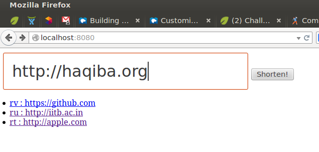

# startclojure

A Clojure web app for URL shortening.
Inspired by [http://cemerick.com](http://cemerick.com/2012/05/02/starting-clojure/)



## Usage

### Clone
```sh
git clone https://github.com/psachin/startclojure
```

### Install dependencies
(You should have `lein` installed)

```sh
cd startclojure
lein deps
```

### Run
From REPL prompt, invoke

```elisp
(def server (jetty/run-jetty #'app {:port 8080 :join? false}))
```

Visit `localhost:8080` using a web browser.
(See commit messages for more detail.)

## License

Copyright © 2014 Sachin Patil.
Distributed under the GNU GPL v3.0 or later
